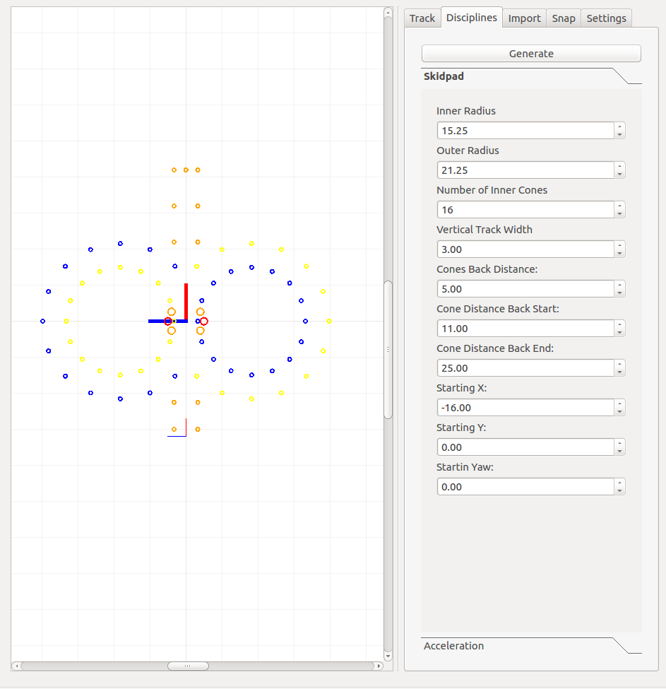

## Basic Configuration
The basic run configuration are described in a file similar to [simulation.yaml](../fssim/config/simulation.yaml). 
* One can pick there a vehicle used for the set of simulation runs. This vehicle must be created in [cars](../fssim/config/simulation.yaml) folder. 
* Maximal time for a simulation repetition is set under `kill_after`. If a run runs longer than this time in seconds, the run will be killed and assumed to be unsacesfull.
* The further files are located in a directory with respect to `pkg_config_storage`
  * Every single repetition must be specifies with three files, `sensors_config_file`, `track_name` and `autonomous_stack`
  * The sensor config file contains the specifig sensor configuration
  * Track have a `.sdf` file under [track](../fssim_gazebo/models/track) and a `.yaml` file under [tracks_yaml](../fssim_gazebo/models/track/tracks_yaml).
  * The last, autonomous stack, contains a command (e.g. `roslaunch some_pkg some_file.launch`) which start the entire autonomous pipeline. If this argument is empty, no additional stuck is started and only the simulation is launched. 
 * The next flags enable automatic RES (Remote Emergancy Brake) under those conditions
 * At the end `rosbag_record` contains a command which starts logging. 

## Change the vehicle configuraion
The all vehicle dimensions and car configurations are stored in [cars/some_car/config](../fssim_description/cars/gotthard/config) folder.  The main vehicle properties are stored in file [car.yaml](../fssim_description/cars/gotthard/config/car.yaml).

## Creating a new track
A new discipline track (skidpad/acceleration/trackdrive) can be created from `rqt_fssim_track_editor`. After running `roscore` in a separate window, execute `rosrun rqt_fssim_track_editor rqt_fssim_track_editor` which will launch the editor. This allows you to draw a center of a track, press and hold `Ctrl` and with click of left mouse button "draw" a center of a track. After you are done, press `Compute Track` which will generate the track cones based on under specified properties. Furthermore, set Track Name (e.g. `Track Name: track_test`) and press `Export Track`. This will automatically generate neccessary files under [track](../fssim_gazebo/models/track) and [tracks_yaml](../fssim_gazebo/models/track/tracks_yaml). You need to just change name under [simulation.yaml](../fssim/config/simulation.yaml) and property `track_name` with the name you endered under Track Name e.g. `track_name: track_test.sdf`.

After you change tab to `Disciplines`, pick a discipline, set it as you like and press `Generate`. After change back to `Track` tab and press `Export`, you do not need to set `Track Name:`.  

#### Trackdrive

#### Skidpad

#### Acceleration

